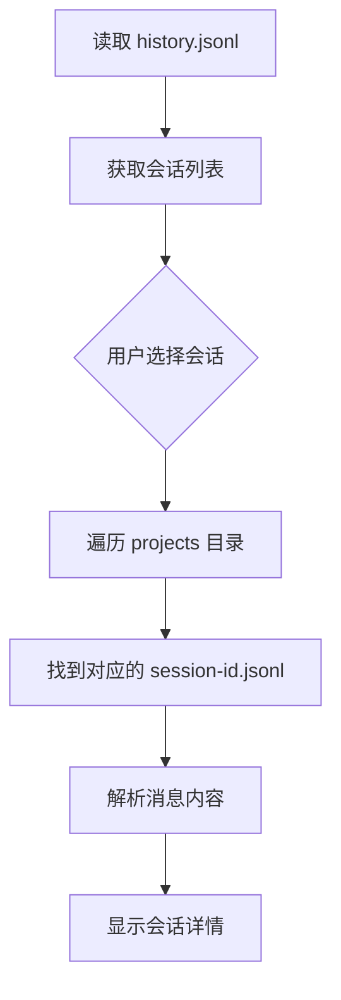

# Claude Code 数据存储结构

本文档说明 Claude Code 的历史数据是如何存储在本地文件系统中的。

## 目录结构

```
~/.claude/
├── history.jsonl              # 会话索引文件
└── projects/                  # 项目目录
    ├── project-1-path/        # 项目1（实际是项目路径的hash或简写）
    │   ├── <session-id-1>.jsonl
    │   ├── <session-id-2>.jsonl
    │   └── ...
    ├── project-2-path/
    │   ├── <session-id-3>.jsonl
    │   └── ...
    └── ...
```

## 文件说明

### 1. `~/.claude/history.jsonl` - 会话索引文件

这是**所有会话的元数据索引**，每行是一条 JSON 记录。

```json
{
  "display": "实现性能优化和渐进式加载",
  "timestamp": 1737312345678,
  "project": "/Users/ethan/Documents/src/claude-history",
  "sessionId": "abc123def456...",
  "pastedContents": {}
}
```

| 字段 | 说明 |
|------|------|
| `display` | 会话标题（通常是用户的第一条输入摘要） |
| `timestamp` | 会话创建时间戳（毫秒） |
| `project` | 项目路径 |
| `sessionId` | 唯一会话ID（UUID） |
| `pastedContents` | 粘贴内容（可选） |

**用途：** 快速列出所有会话，无需读取每个会话的详细内容。

### 2. `~/.claude/projects/<project>/<session-id>.jsonl` - 会话详情文件

这是**每个会话的完整消息记录**，存储在对应的项目目录下。

每行是一条 JSON 消息，包含以下类型：

#### 用户消息 (`type: "user"`)
```json
{
  "type": "user",
  "message": {
    "role": "user",
    "content": "帮我实现一个功能..."
  },
  "uuid": "msg-uuid-1",
  "sessionId": "session-id",
  "timestamp": "2025-01-19T10:30:00.000Z",
  "cwd": "/path/to/project",
  "gitBranch": "main"
}
```

#### AI回复 (`role: "assistant"`)
```json
{
  "message": {
    "role": "assistant",
    "content": "我来帮你实现..."
  },
  "uuid": "msg-uuid-2",
  "timestamp": "2025-01-19T10:30:01.000Z"
}
```

#### 工具调用 (`type: "tool_use"`)
```json
{
  "type": "tool_use",
  "content": "tool name and parameters...",
  "uuid": "msg-uuid-3",
  "timestamp": "2025-01-19T10:30:02.000Z"
}
```

#### 工具结果 (`type: "tool_result"`)
```json
{
  "type": "tool_result",
  "content": "tool execution result...",
  "uuid": "msg-uuid-4",
  "timestamp": "2025-01-19T10:30:03.000Z"
}
```

## 数据读取流程



## 常见问题

### Q: 用户输入和 AI 输出存储在哪里？
**A:** 都存储在 `~/.claude/projects/<project>/<session-id>.jsonl` 文件中。

### Q: history.jsonl 存储完整内容吗？
**A:** 不，`history.jsonl` 只存储会话的元数据（索引），完整内容在各自的会话文件中。

### Q: 为什么按项目目录分组？
**A:** 这样可以更好地组织数据，也便于按项目筛选会话。

### Q: 如何自定义数据目录？
**A:** 设置环境变量 `CLAUDE_DIR` 可覆盖默认的 `~/.claude` 目录。

```bash
export CLAUDE_DIR=/custom/path/.claude
```

## 相关代码

- 数据加载逻辑: `lib/claude-history.ts`
- 类型定义: `lib/types.ts`
